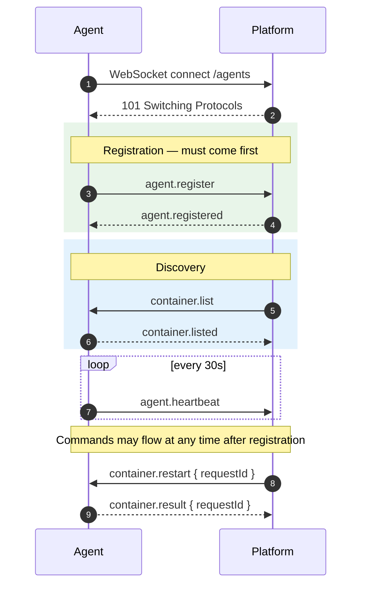
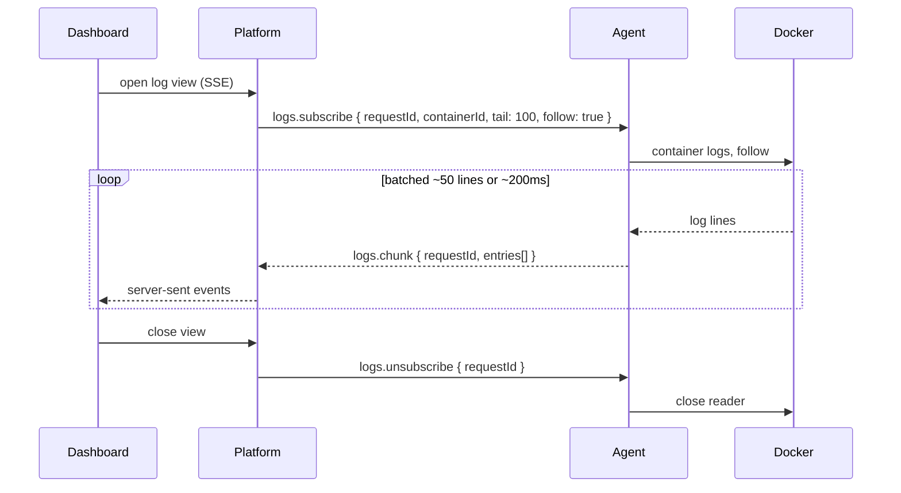

# WebSocket protocol

This page explains how the platform and agents talk: the envelope, the
lifecycle, and the conventions behind them.

!!! info "The specification lives next door"
    [protocol.md](protocol.md) is the **source of truth** — every message type,
    every field, every table. This page explains the *design*; go there for the
    exact contract when implementing.

---

## Transport

| Item | Value |
| --- | --- |
| Transport | Native WebSocket, JSON text frames |
| Endpoint | `ws://<host>:<port>/agents` or `wss://` |
| Encoding | UTF-8 JSON |
| Direction | Always initiated by the agent |
| Spec revision | v0.1 |

Binary frames are not used. Text frames keep the protocol inspectable with
ordinary tooling — you can watch a session in browser devtools or `websocat`
without a decoder.

---

## The envelope

Every message, in both directions, is the same shape:

```json
{
  "type": "domain.action",
  "payload": { }
}
```

| Field | Type | Required | Description |
| --- | --- | --- | --- |
| `type` | string | yes | Lowercase, `domain.action` |
| `payload` | object | yes | Type-specific body; `{}` when empty |

Three rules make this forward compatible:

1. Receivers **ignore unknown `payload` fields**, so new optional fields ship
   without breaking older peers.
2. Receivers **ignore unknown `type` values** without closing the connection, so
   a newer platform can send message types an older agent has never heard of.
3. `payload` is always an object — never an array, string or `null` — so it can
   gain fields later.

`id`, `replyTo`, `ts` and `v` are **reserved** envelope fields for a future
revision. Do not send them yet.

### Naming

`<domain>.<action>` — for example `agent.register`, `container.start`,
`logs.chunk`.

| Domain | Purpose |
| --- | --- |
| `agent` | Identity, session, liveness |
| `container` | Container discovery and lifecycle |
| `logs` | Log streaming and its control messages |
| `metrics` | Resource sampling (reserved) |
| `event` | Docker and host events (reserved) |
| `error` | Structured errors (reserved) |
| `system` | Protocol control (reserved) |

Request/response pairs use related names: `container.inspect` →
`container.inspected`, `agent.register` → `agent.registered`.

---

## Session lifecycle



Rules that matter when implementing:

1. The agent **must** send `agent.register` before anything else.
2. The platform ignores or rejects other messages until registration succeeds.
3. Heartbeats run every **30 seconds**.
4. On disconnect the agent reconnects and re-registers. The current client
   retries with exponential backoff, a 30-second cap, and jitter, so the
   wait before each attempt is variable.
5. The platform may mark the agent `OFFLINE` as soon as the socket closes.

---

## Request correlation

Commands that expect an answer carry a `requestId` generated by the platform.
The agent echoes it verbatim.

```json title="Server → Agent"
{
  "type": "container.restart",
  "payload": {
    "requestId": "3f1c9a2e-8b44-4d1a-9c2e-1a2b3c4d5e6f",
    "containerId": "abc123def456"
  }
}
```

```json title="Agent → Server"
{
  "type": "container.result",
  "payload": {
    "requestId": "3f1c9a2e-8b44-4d1a-9c2e-1a2b3c4d5e6f",
    "action": "restart",
    "containerId": "abc123def456",
    "ok": true,
    "message": "restart succeeded",
    "error": null
  }
}
```

Why correlation instead of strict request/response ordering: one socket carries
everything. A `docker stop` that takes 10 seconds must not delay a log chunk or
a heartbeat. With `requestId`, responses can arrive in any order and the platform
still knows which API caller is waiting.

Note the result shape: `ok` is a boolean and `error` carries Docker's own
message. Failures are *data*, not exceptions — a container that refuses to stop
is a normal outcome the operator needs to see verbatim.

---

## Implemented messages

| Type | Direction | Purpose |
| --- | --- | --- |
| `agent.register` | Agent → Platform | Announce identity and host details |
| `agent.registered` | Platform → Agent | Confirm registration |
| `agent.heartbeat` | Agent → Platform | Liveness, every 30s |
| `container.list` | Platform → Agent | Request container discovery |
| `container.listed` | Agent → Platform | Container summaries |
| `container.inspect` | Platform → Agent | Request inspect data |
| `container.inspected` | Agent → Platform | Inspect data, correlated |
| `container.start` | Platform → Agent | Start a container |
| `container.stop` | Platform → Agent | Stop a container |
| `container.restart` | Platform → Agent | Restart a container |
| `container.pause` | Platform → Agent | Freeze a running container, keeping memory |
| `container.unpause` | Platform → Agent | Resume a paused container |
| `container.result` | Agent → Platform | Outcome of a lifecycle command |
| `logs.subscribe` | Platform → Agent | Begin streaming container logs |
| `logs.chunk` | Agent → Platform | Batched log entries |
| `logs.unsubscribe` | Platform → Agent | End one stream |

Full payload tables: [protocol.md](protocol.md#5-implemented-messages-v01).

### Registration

```json
{
  "type": "agent.register",
  "payload": {
    "uuid": "bc2bc07d-e456-4979-9f11-3293965d7436",
    "hostname": "srv789756",
    "os": "linux",
    "architecture": "amd64",
    "version": "0.1.0"
  }
}
```

The platform upserts by `uuid`, sets `status=ONLINE` and updates `lastSeen`.
Because it is an upsert, re-registering after every reconnect is safe and
requires no cleanup.

### Heartbeat

```json
{
  "type": "agent.heartbeat",
  "payload": { "uuid": "bc2bc07d-e456-4979-9f11-3293965d7436" }
}
```

There is **no acknowledgement**, deliberately. Silence is success. An ack would
double heartbeat traffic to tell the agent something the socket already proves.

### Log streaming



Logs are **batched**, not sent line by line: a chatty container can emit
thousands of lines per second, and one frame per line would spend more time in
JSON overhead than in payload. Chunks flush at roughly 50 entries or 200 ms,
whichever comes first — bounded latency with bounded overhead.

Streams are not persisted. `logs.unsubscribe` releases the Docker reader on the
agent, which is why closing a log view matters: an abandoned subscription holds
an open reader on the host.

---

## Status values

| Value | Meaning |
| --- | --- |
| `ONLINE` | Connected and recently seen |
| `OFFLINE` | Disconnected |
| `UNKNOWN` | Unspecified or error path |

New values must be documented in [protocol.md](protocol.md#7-status-values)
before use.

---

## Reserved, not yet implemented

These type names are reserved so future work cannot invent conflicting shapes:

| Type | Purpose |
| --- | --- |
| `error.report` | Structured error without closing the socket |
| `container.remove` | Remove a container |
| `metrics.subscribe` / `metrics.unsubscribe` / `metrics.sample` | Resource metrics |
| `event.docker` | Docker and host lifecycle events |

Draft payloads are in [protocol.md](protocol.md#6-reserved-message-types-not-implemented-yet).

---

## Versioning policy

1. The spec revision lives in [protocol.md](protocol.md) — currently **v0.1**.
2. **Additive** changes (new optional fields, new types) do not require a major
   bump.
3. **Breaking** changes (renamed or removed fields, changed semantics) require a
   major bump and a migration note.
4. When the envelope's `v` field is activated, peers negotiate compatibility with
   it.

---

## Current non-goals

Stated plainly, because they affect how you should deploy today:

- **No authentication** on agent connections. Anything that can reach `/agents`
  can register as an agent.
- **No message-level encryption.** Use `wss://` and terminate TLS at your proxy.
- **No multiplexing** beyond message `type` and `requestId`.
- **No binary payloads.**

See [Security](security.md#current-limitations).

---

## Implementation map

| Side | Location |
| --- | --- |
| Shared TypeScript contracts | `packages/protocol` |
| Human specification | `docs/protocol.md` |
| Platform gateway | `apps/server/src/agents/agents.gateway.ts` |
| Agent client | `apps/agent/internal/communication/client.go` |
| Agent identity | `apps/agent/internal/identity/` |

When adding a message type, update `docs/protocol.md` **and**
`packages/protocol` in the same change, then implement both sides. The envelope
never changes.
